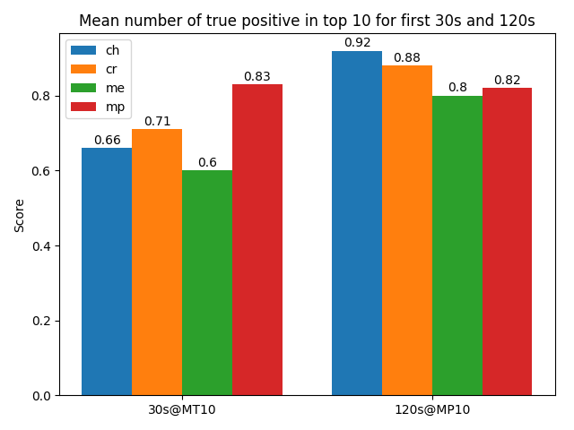
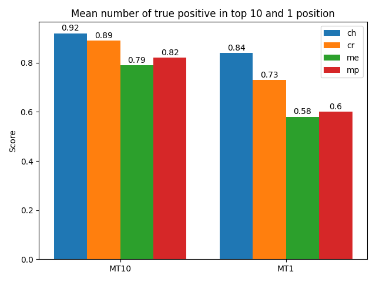
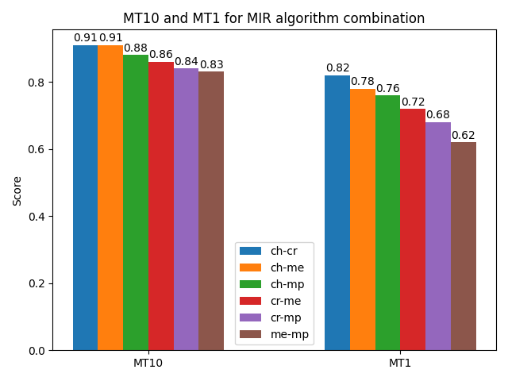
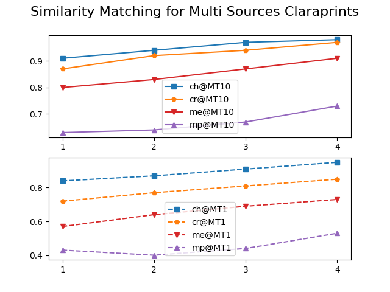
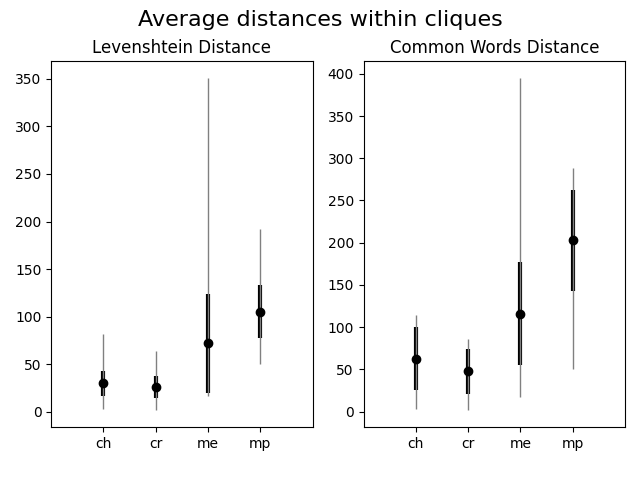

# Claraprint

Claraprint is a cover song (or musical work) fingerprint based on rough chord and melody extraction. It has been thought to be used
for classical music where these non-accurate features are proved to be enough in certain circumstances to capture the 
musical work unicity.

This code is used in the research paper CLARAPRINT: A CHORD AND MELODY BASED FINGERPRINT FOR WESTERN CLASSICAL MUSIC COVER DETECTION.
All experiments and figures are reproducible by following the present instructions and using this code.

This code is under [MIT Licence](LICENCE.txt).

## Usage

After referencing this code in your project, run the following commands.

### Build a claraprint

```python
from claraprint import claraprint

algo = "chords_chordino"
# can also be "chords_crema", "melody_piptrack", "melody_melodia"

audio_file_path = "/data/audio/myfile.mp3"
cp = claraprint(audio_file_path, algo)

# cp is a string
print(cp)
```

## Installation

To install claraprint

1. Create a python3 virtual environment `virtualenv ~/.env/claraprint -p /usr/bin/python3` and activate it `source ~/.env/claraprint/bin/activate`
2. Clone this repository `git clone https://github.com/miqwit/claraprint`
3. Install the dependency with `pip install -r requirements.txt`

> **Warning**: During the installation of requirements, you may see the following error: `ERROR: crema 0.1.0 has requirement librosa==0.5, but you'll have librosa 0.7.2 which is incompatible.` This version of `crema` references `librosa==0.5` but actually works unders `librosa==0.7.2`. Id does not work under `librosa==0.5`. See [raised issue on GitHub](https://github.com/bmcfee/crema/issues/31). 

## Reproducibility

This section explains how to rerun the experiments in the scientific paper CLARAPRINT: A CHORD AND MELODY BASED FINGERPRINT FOR WESTERN CLASSICAL MUSIC COVER DETECTION.

### Used versions

* Python 3.6.9
* Elasticsearch 7.6.2
* Dependencies: see [requirements.txt](requirements.txt)

### Installation for reproducibility

Additionally to the previous installation section, you must run an Elasticsearch instance that will be used to store 
and expose the fingerprints for research. We used Docker to run an Elasticsearch (version 7.6.2) sever locally.

```
docker run \
-e "indices.query.bool.max_clause_count=10000" \
-e "http.max_initial_line_length=1mb" \
-e "http.max_header_size=1mb" \
-e "discovery.type=single-node" \
-e "http.cors.enabled=true" \
-e "http.cors.allow-origin=moz-extension://45f04639-6ef3-476e-b943-9a9e856b309e" \
-d \
--name claraes_7.6.2 \
-p 9200:9200 \
docker.elastic.co/elasticsearch/elasticsearch:7.6.2
```

### Run an experiment

The main experiment file script is [es_multiple_fp_generated](experiments/es_multiple_fp_generated/es_multiple_fp_generated.py).
 It allows to run different experiments, and not only multiple fingerprint ones, as the name of the file suggests.
 Clone this repository and go to the main `claraprint/` folder.
 
#### Download the dataset

Download the dataset `dataset_rdb_100.jams.json` in folder `dataset`.

#### Configuration

Before running an experiment, open the file, and edit the `configs_to_run` variable. Here is an example of its value:

```python
configs_to_run = [
    Config(algo="chords_chordino", duration=120, letters_to_use=1, range_words=[range(2, 8)], num_sources=[1]),
    Config(algo="chords_crema", duration=120, letters_to_use=1, range_words=[range(2, 8)], num_sources=[1]),
    Config(algo="melody_melodia", duration=120, letters_to_use=3, range_words=[range(2, 8)], num_sources=[1]),
    Config(algo="melody_piptrack", duration=120, letters_to_use=3, range_words=[range(2, 8)], num_sources=[1])
]
``` 

This example will run 4 configurations, for 4 different algorithms (property `algo`). The details of the parameters
can be found in the source file, and is repeated here:

- **algo**: which algo to run. Can be chords_chordino, chords_crema, melody_melodia, melody_piptrack
- **duration**: which samples to use. In these experiment, only 30s and 120s are precomputed. Use int 30 or 120.
- **letters_to_use**: set of letters to use for a claraprint. Is defined in fingerprints.py. Traditionally, 1 is for 
  chords and 3 is for melody. 2 is unused. It is useful to use different sets for combinatory fingerprints 
  (chords + melody)
- **range_words**: for the given configuration, the different sizes of words to use. Contains a list of range objects.
- **num_sources**: how many audio files to use to generate one claraprint
- **num_bests**: will display in the results how many times a fingerprint was found in the N top values of a search result.
  Contains a list. For example [10, 5, 1] will display the presence of a given claraprint in the top 10, top 5 and top 1
  (= is it the first result) of a search.
- **fingerprint_from_one_source**: reference to a function to mix fingerprints from different sources. Such function, like
  fingerprint_from_n_sources, can be found in the utils_experiments.py file. You can write your own.
- **search_func**: reference to a function to run a search query against the elasticsearch. Such functions are to be found
  in the file experiments.es_helper.py.
- **ingest_func**: reference to a function to ingest a document (claraprint) inside the Elasticsearch index. Such functions
  are to be found in the file experiments.es_helper.py.
- **createindex_func**: reference to a function to create the Elasticsearch index.
- **rounds**: number of times the configuration is run. Because the works are taken randomly in the dataset, it's worth
  running the config several times to consolidate the result.
- **combination_mode**: when several fingerprints are used (num_sources > 1), how do we combine the fingerprint, can be
  'union' or 'intersection'. This is implemented in the fingerprint_from_n_sources function.

#### Run experiment

Run the experiment with the command:

```shell script
PYTHONPATH=. python experiments/es_multiple_fp_generated/es_multiple_fp_generated.py
```

The result output will look like the following:

```shell script
algo=chords_chordino,#sources=1,dur=120,search_func=<function es_search at 0x7fc17c381c80>,num_bests=[10, 5, 1],ranges=2_7,time_insert=0.004182252782344118,time_query=0.007569167613983154,scores=0.92 0.90 0.84
algo=chords_crema,#sources=1,dur=120,search_func=<function es_search at 0x7fc17c381c80>,num_bests=[10, 5, 1],ranges=2_7,time_insert=0.0055517343672130195,time_query=0.0060963606834411625,scores=0.89 0.85 0.73
algo=melody_melodia,#sources=1,dur=120,search_func=<function es_search at 0x7fc17c381c80>,num_bests=[10, 5, 1],ranges=2_7,time_insert=0.006374508779975532,time_query=0.009945457935333251,scores=0.80 0.73 0.58
algo=melody_piptrack,#sources=1,dur=120,search_func=<function es_search at 0x7fc17c381c80>,num_bests=[10, 5, 1],ranges=2_7,time_insert=0.006635935948595122,time_query=0.015183436393737792,scores=0.83 0.77 0.60
```

Each line is one configuration. The parameters are displayed inline as a reminder of the set configuration.

The most important part is the last part of this output:
```shell script
scores=0.92 0.90 0.84
scores=0.89 0.85 0.73
scores=0.80 0.73 0.58
scores=0.83 0.77 0.60
```

Each score contains three values, because here `num_best=[10, 5, 1]`. The first value is the percentage of fingerprints 
found in the first 10 results (MT10 in the paper), the second one in the first 5 results (MT5) and the last one as 
the first result (MT1) of the fingerprint search.  

### Generate figures as presented in the paper

#### Figure 2: Mean value of true positive in top 10 for claraprints computed on the first 30s and 120s.



Run the experiment with the following configurations:

```python
configs_to_run = [
    Config(algo="chords_chordino", duration=30, letters_to_use=1, range_words=[range(2, 8)], num_sources=[1]),
    Config(algo="chords_crema", duration=30, letters_to_use=1, range_words=[range(2, 8)], num_sources=[1]),
    Config(algo="melody_melodia", duration=30, letters_to_use=3, range_words=[range(2, 8)], num_sources=[1]),
    Config(algo="melody_piptrack", duration=30, letters_to_use=3, range_words=[range(2, 8)], num_sources=[1]),

    Config(algo="chords_chordino", duration=120, letters_to_use=1, range_words=[range(2, 8)], num_sources=[1]),
    Config(algo="chords_crema", duration=120, letters_to_use=1, range_words=[range(2, 8)], num_sources=[1]),
    Config(algo="melody_melodia", duration=120, letters_to_use=3, range_words=[range(2, 8)], num_sources=[1]),
    Config(algo="melody_piptrack", duration=120, letters_to_use=3, range_words=[range(2, 8)], num_sources=[1]),
]
```

> The first 4 are testing the 4 algos against 30s claraprints, and the last 4 against 120s claraprints.

Report the first score for each in the following lines of file [generate_graph_compare_algos_duration.py](figures/generate_graph_compare_algos_duration.py):

```python
chord_chordino_means = [0.66, 0.92]
chord_crema_means = [0.71, 0.88]
melody_melodia_means = [0.60, 0.80]
melody_piptrack_means = [0.83, 0.82]
```

Run the script [generate_graph_compare_algos_duration.py](figures/generate_graph_compare_algos_duration.py), which will generate figure [graph_compare_algos_duration.png](figures/graph_compare_algos_duration.png)

#### Figure 3: Mean value of true positive in top 10 (MT10) and first (MT1) position for 120s claraprints.



Run the experiment with the following configurations:

```python
configs_to_run = [
    Config(algo="chords_chordino", duration=120, letters_to_use=1, range_words=[range(2, 8)], num_sources=[1]),
    Config(algo="chords_crema", duration=120, letters_to_use=1, range_words=[range(2, 8)], num_sources=[1]),
    Config(algo="melody_melodia", duration=120, letters_to_use=3, range_words=[range(2, 8)], num_sources=[1]),
    Config(algo="melody_piptrack", duration=120, letters_to_use=3, range_words=[range(2, 8)], num_sources=[1])
]
```

> Each configuration is searching for 120s claraprint fingerprints comparing the 4 different algos

Report the first (MT10) and last (MT1) scores in file [generate_graph_compare_algos.py](figures/generate_graph_compare_algos.py):

```python
chord_chordino_means = [0.92, 0.84]
chord_crema_means = [0.89, 0.73]
melody_melodia_means = [0.79, 0.58]
melody_piptrack_means = [0.82, 0.60]
```

Run the script [generate_graph_compare_algos.py](figures/generate_graph_compare_algos.py), 
which will generate figure [graph_compare_algos_duration.png](figures/graph_compare_algos.png)

#### Figure 4 Mean value of true positive in top 10 (MT10) and first (MT1) position of combined [2-7]-shingled claraprints.



For this one, the used experiment is not the "usual" ones, as explained in previous section, but the one located in
[es_cross_sources.py](experiments/es_cross_sources/es_cross_sources.py) file. It is the same logic, although the 
configuration parameters may differ a little bit.

```python
configs_to_run = [
    Config(algos=["chords_chordino", "melody_melodia"], range_words=[range(2, 8)], search_func=es_search_shingle),
    Config(algos=["chords_chordino", "melody_piptrack"], range_words=[range(2, 8)], search_func=es_search_shingle),
    Config(algos=["chords_crema", "melody_melodia"], range_words=[range(2, 8)], search_func=es_search_shingle),
    Config(algos=["chords_crema", "melody_piptrack"], range_words=[range(2, 8)], search_func=es_search_shingle),
    Config(algos=["chords_chordino", "chords_crema"], range_words=[range(2, 8)], search_func=es_search_shingle),
    Config(algos=["melody_melodia", "melody_piptrack"], range_words=[range(2, 8)], search_func=es_search_shingle),
]
```

> Each configuration is combining a chord algo with a melody algo. All configuration are tested and compared.

Report the first (MT10) and last (MT1) scores in file [generate_graph_compare_algos_multiple.py](figures/generate_graph_compare_algos_multiple.py):

```python
ch_me_means = [0.91, 0.78]
ch_mp_means = [0.88, 0.76]
cr_me_means = [0.86, 0.72]
cr_mp_means = [0.84, 0.68]
ch_cr_means = [0.91, 0.82]
me_mp_means = [0.83, 0.62]

```

Run the script [generate_graph_compare_algos_multiple.py](figures/generate_graph_compare_algos_multiple.py), 
which will generate figure [graph_compare_algos_multiple.png](figures/graph_compare_algos_multiple.png)

#### Figure 5 Mean value @10 and @1 of multiple-recording [2-7]-shingled claraprint combination, from 1 to 4 recordings of the same piece.



Run the experiment with the following configurations:

```python
configs_to_run = [
    Config(algo="chords_chordino", duration=120, letters_to_use=1, range_words=[range(2, 8)], num_sources=[1, 2, 3, 4]),
    Config(algo="chords_crema", duration=120, letters_to_use=1, range_words=[range(2, 8)], num_sources=[1, 2, 3, 4]),
    Config(algo="melody_melodia", duration=120, letters_to_use=3, range_words=[range(2, 8)], num_sources=[1, 2, 3, 4]),
    Config(algo="melody_piptrack", duration=120, letters_to_use=3, range_words=[range(2, 8)], num_sources=[1, 2, 3, 4])
]
```

> For each algorithm, 1, 2, 3 and 4 claraprints are used to generate a reference claraprint.

Report the first (MT10) score for each num_source in file [generate_multiple_source_line.py](figures/generate_multiple_source_line.py):

```python
df = pd.DataFrame({
    'x': range(1, 5),
    'ch@MT10': np.array([0.91, 0.94, 0.97, 0.98]),
    'cr@MT10': np.array([0.87, 0.92, 0.94, 0.97]),
    'me@MT10': np.array([0.80, 0.83, 0.87, 0.91]),
    'mp@MT10': np.array([0.63, 0.64, 0.67, 0.73]),

    'ch@MT1': np.array([0.84, 0.87, 0.91, 0.95]),
    'cr@MT1': np.array([0.72, 0.77, 0.81, 0.85]),
    'me@MT1': np.array([0.57, 0.64, 0.69, 0.73]),
    'mp@MT1': np.array([0.43, 0.40, 0.44, 0.53])
})

```

> For example, in line `'ch@MT10': np.array([0.91, 0.94, 0.97, 0.98])`, 0.91 is MT10 for algo chords_chordino (ch) for one source fingerprint, and 0.94 for two sources, etc.

Run the script [generate_multiple_source_line.py](figures/generate_multiple_source_line.py), 
which will generate figure [multiple_source_line.png](figures/multiple_source_line.png)

#### Figure 6 he average, minimal, maximal and standard deviation of pair-wise comparison of claraprints within the same clique, with the Levenshtein similarity algorithm (plain claraprints) and the common words in [2-7]-shingled claraprints.



This figure is not the result of an experiment, but rather a measure of the dataset. Nevertheless, the script to generate
the data is located in [experiments/clique_distances/similarity_chord_per_work.py](experiments/clique_distances/similarity_chord_per_work.py).

Just execute this file and report the values in the file [figures/generate_error_bar_distance.py](figures/generate_error_bar_distance.py):

```python
lev_chord = np.array([[29.856, 26.357, 71.939, 105.469],
                      [3.3, 1.7, 17.2, 50.],
                      [81.4, 64., 350.9, 191.8],
                      [12.7801277, 11.40262474, 51.63729833, 27.97021164]])
```

Run the script [figures/generate_error_bar_distance.py](figures/generate_error_bar_distance.py), 
which will generate figure [figures/error_bar_distance.png](figures/error_bar_distance.png)

